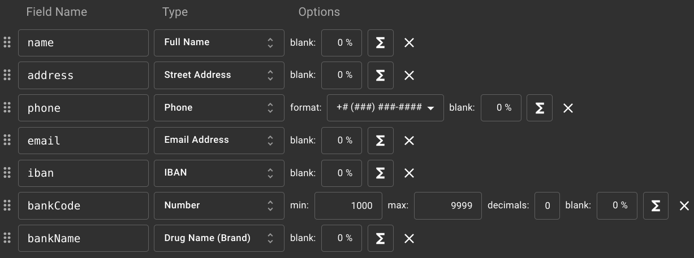
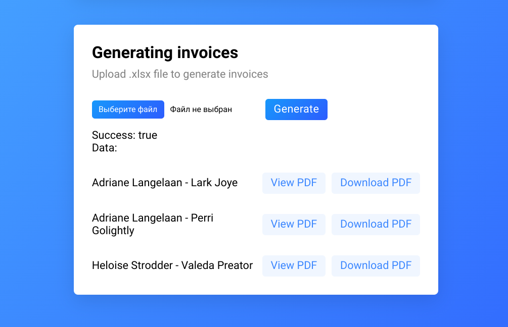
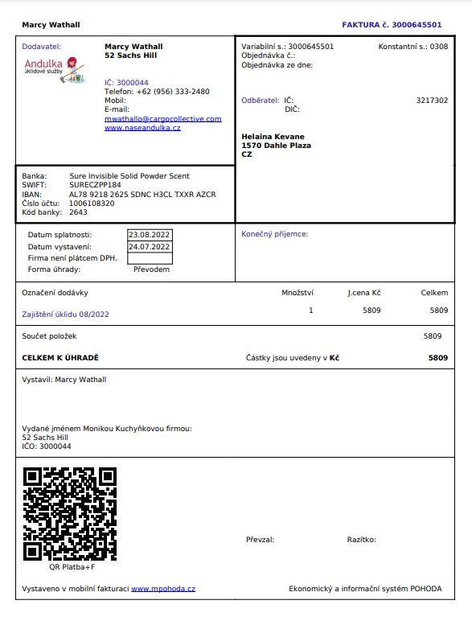

# Invoice Generator

The task, consists of two parts.

* <strong>The first part is creating users</strong>
<br>From the Excel spreadsheet, you need to get the unique IČO codes.
<br>For the each code generate user data using publicly sources and save everything together to the database.

* <strong>The second part is creating an invoice</strong>
<br>From the excel table you need to get the amount and IČO codes of the supplier and recipient. Then you need to get the data from the database for each user. Further you need to generate invoices in pdf format, using the received data.

<br>

### 🛠 Technology stack
The server side of the app will be developed in PHP. This language is perfect for the tasks at hand, it has many convenient libraries.

MySQL will be used as the database.

HTML, CSS, JavaScript will be used for the client side of the app.

It would be possible to use the React framework, but the app is so small that its use would not be rational.

<br>

### 🚀 Let's start
First we need to find an open data source to generate test user data. I chose [Mockaroo](https://mockaroo.com). This is a convenient API that is highly configurable and returns data in JSON.

#### Get data:

```http
  GET https://api.mockaroo.com/api/131d4840
```

| Parameter | Type     | Description                |
| :-------- | :------- | :------------------------- |
| `count`   | `number` | **Required**. Count of data|
| `key`     | `string` | **Required**. Your API key |

<br>

#### Generating data:



<br><br>

Further we need to parse the Excel file. For this I chose [SimpleXLSX](https://github.com/shuchkin/simplexlsx).

We get IČO codes from the Excel, filter only unique ones.

For each key we generate user data.

SWIFT is generated using the first 4 characters of the bank name, country code and random 4 numbers at the end.

We add the received data to the table and make the IČO field in the database unique so that the next time the user is not duplicated.

<br>

### Invoice generation

At this stage we have the data of all users in the database.

We also have an Excel file with IČO codes and amount.


We need to generate:

* account number (10 random numbers)

* invoice date (current date)

* date of payment (current date + 30 days)

* invoice number (10 random numbers)

After that we can proceed to the development of pdf. For this I chose [TCPDF](https://tcpdf.org/).

This library also can to generate QR code.

<br>

### User's Manual

1. Upload Excel file to add new users to database. File must be in .xlsx format.
File must contain IČO codes.
<br><br>

<br><br>
2. Upload Excel file to generate invoices. File must be in .xlsx format.
File must contain IČO codes and amount.

3. You will receive a list of PDF documents that you can download or open in your browser without downloading.
<br><br>

<br><br>
Result:
<br><br>

<br>
<br>

### Possible improvements

* To make an additional check for the presence of the necessary columns of the excel file.

* To collect a list of users from excel and get data from the database only from them, if there are a lot of users in the databas
This would be better in terms of optimization.